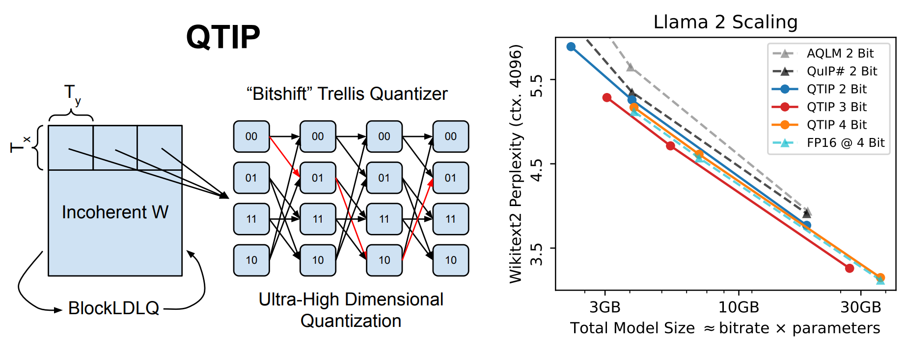

# QTIP: Quantization with Trellises and Incoherence Processing [[arXiv]](https://arxiv.org/abs/2406.11235)



This repository contains code for QTIP, a weight-only large language model (LLM) quantization method that achieves a state-of-the-art combination of quantization quality and speed.
QTIP uses incoherence processing to make LLM weight matrices approximately i.i.d Gaussian, and then uses trellis coded quantization (TCQ) to quantize these weights with near-optimal distortion.
QTIP solves naive TCQ's inherent slowness by introducing a series of novel compute-based codes for use with the "bitshift trellis."
For more details, please see the [paper](https://arxiv.org/abs/2406.11235).

## How to use this codebase

This codebase is based off of the [QuIP#](https://github.com/Cornell-RelaxML/quip-sharp) codebase, with modifications made to support trellis quantization.
The main QTIP code is in `lib/codebook/bitshift.py`, and the QuIP# algorithm files have been merged into `lib/algo/finetune.py`.
Example scripts can be found in `examples/`

The main QTIP-related arguments in `quantize_llama/quantize_finetune_llama.py` are:
- `L`, `K`, `V`: same as in the paper.
- `tlut_bits`: the number of tunable lookup table bits. This is Q for the HYB code. Set this to 0 if using 3INST or 1MAD or L if using a pure LUT.
- `decode_mode`: `quantlut_sym` (HYB), `3inst` (3INST), `1mad` (1MAD), or 'lut' (pure LUT).
- `td_x` and `td_y`: dimensions of trellis tile in LDLQ ($T_x$ and $T_y$ in the paper). `td_x` goes along the output dimension and `td_y` the input (channel) dimension.

## Fast inference

QTIP achieves the same inference throughput as QuIP# despite achieving higher quality quantization.
The numbers below measure bs=1 inference speed on a RTX6000 Ada with matrix fusion (q, k, and v, and up and gate together) for QuIP# and QTIP.

|    Method   |    2-7B    | 2-70B |
|:-----------:|:----------:|:-----:|
|     FP16    | 55.9 tok/s |  OOM  |
|  AQLM 2 Bit |    81.5    |  8.78 |
| QuIP# 2 Bit |     186    |  22.2 |
|  QTIP 2 Bit |     188    |  23.5 |

This codebase contains 2, 3, and 4 bit matrix-vector multiplication kernels for the HYB code with L=16, Q=9, V=2, and $T_x = T_y = 16$.
These kernels are located in `qtip_kernels` and have been integrated into the `BitshiftLinear` class in `lib/codebook/bitshift.py`.
`eval/interactive_gen.py` contains a simple generation script that is compatible with those kernels and CUDA graphs (through `torch.compile`).
This script *does not implement matrix fusion* so you will not get get the speeds in the table if you run it.
If you wish to quantize a model with matrix fusion, the QuIP# codebase has plumbing to do so and should mostly translate over to this one.

### Compiling the kernels

```
cd qtip-kernels
python setup.py install
```

## Prequantized Models

Below are some prequantized Llama 2 models using QTIP with the HYB code, L=16, V=2, and K (bitrate) = 2. These models are compatible with the inference kernels in `qtip-kernels` and can be used by passing in the HF Hub path to the `--hf-path` flag in the eval scripts.

| Model            | HF Hub Repo                        | W2 PPL | C4 PPL | ArcC | ArcE | BoolQ | PiQA | Winogrande |
|------------------|------------------------------------|:------:|:------:|:----:|:----:|:-----:|:----:|:----------:|
| Llama 2 7B       | relaxml/Llama-2-7b-QTIP-2Bit       |  5.86  |  7.73  | 0.36 | 0.66 |  0.67 | 0.76 |    0.65    |
| Llama 2 7B chat  | relaxml/Llama-2-7b-chat-QTIP-2Bit  |  7.00  |  9.35  | 0.38 | 0.69 |  0.78 | 0.76 |    0.65    |
| Llama 2 13B      | relaxml/Llama-2-13b-QTIP-2Bit      |  5.11  |  6.85  | 0.41 | 0.71 |  0.65 | 0.77 |    0.68    |
| Llama 2 13B chat | relaxml/Llama-2-13b-chat-QTIP-2Bit |  6.04  |  8.15  | 0.43 | 0.72 |  0.82 | 0.77 |    0.69    |
| Llama 2 70B      | relaxml/Llama-2-70b-QTIP-2Bit      |  3.70  |  5.48  | 0.48 | 0.76 |  0.76 | 0.80 |    0.75    |
| Llama 2 70B chat | relaxml/Llama-2-70b-chat-QTIP-2Bit |  4.66  |  6.71  | 0.49 | 0.76 |  0.86 | 0.80 |    0.75    |

## Other

If you found this work useful, please consider citing
```
@misc{tseng2024qtipquantizationtrellisesincoherence,
      title={QTIP: Quantization with Trellises and Incoherence Processing}, 
      author={Albert Tseng and Qingyao Sun and David Hou and Christopher De Sa},
      year={2024},
      eprint={2406.11235},
      archivePrefix={arXiv},
      primaryClass={cs.LG},
      url={https://arxiv.org/abs/2406.11235}, 
}
```
